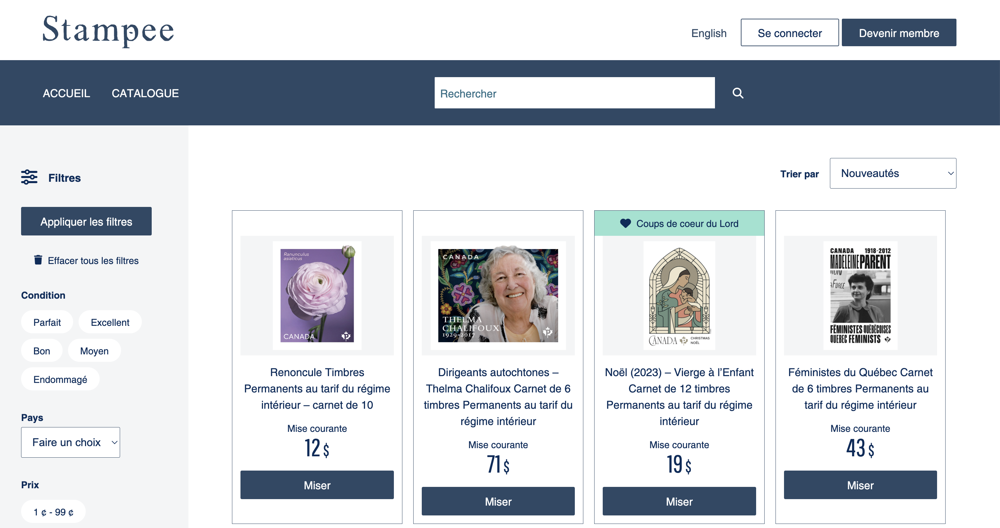

# Projet Stampee

## Connection 

### Database: 
Go to /stampee.sql

### Path configuration
1. Go to /App/Config.php
2. Change 
- const URL_RACINE = "http://localhost:8888/stampee/public/";

### Database configuration
1. Go to /App/Config.php
2. Change the following : 
- const DB_HOST = 'localhost';
- const DB_NAME = 'stampee';
- const DB_USER = 'root';
- const DB_PASSWORD = 'root'; 

### Order stamps by fetch async
On the catalogue page, the stamps are ordered by synchronous PHP code. The project also supports Fetch with async/await by doing the following steps:
1. Go to /public/assets/scripts/classMapping.js
2. Restore line 9: 'TrierEncheres': TrierEncheres,
3. Remove line 10: 'Router': Router,
